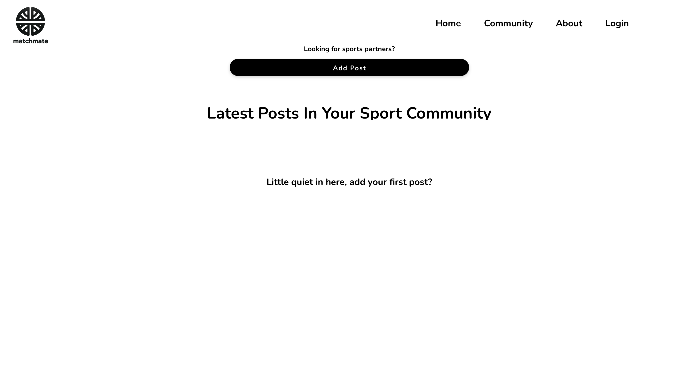
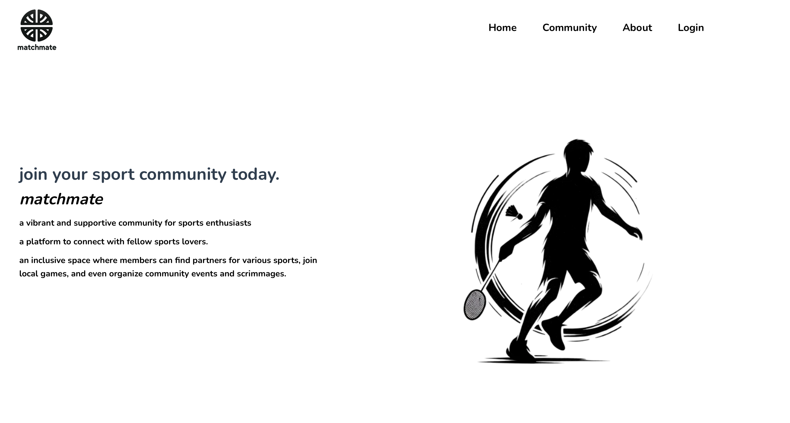
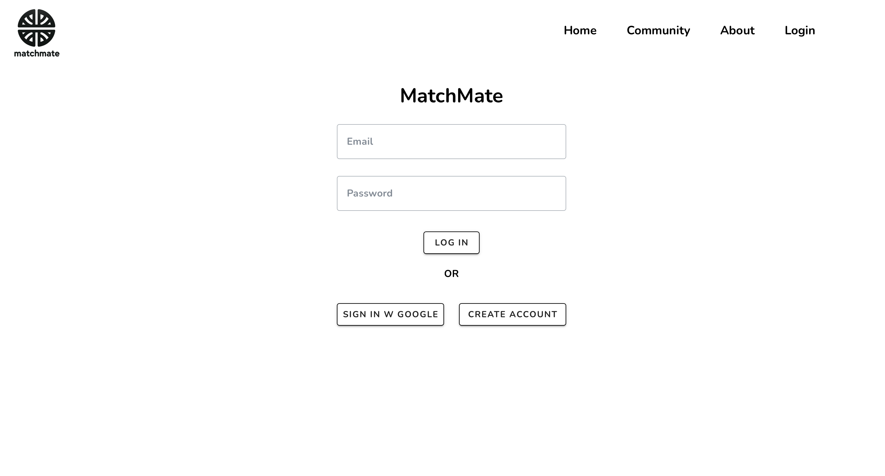

# Match Mate

## Overview

Match Mate is a full-stack university web application built with Vue.js, Firebase for authentication and storage, and MongoDB for database management. This is a final project for CSDS221: Web Development at CWRU, taught by my favorite professor - Dan Izad.

## Languages and Technologies


## Getting Started

Follow these steps to set up the project on your local machine.

### Prerequisites

Make sure you have the following installed:
- [Node.js](https://nodejs.org/)
- [Vue CLI](https://cli.vuejs.org/)

### Clone the Repository

```bash
git clone https://github.com/KhoaLuongCode/Match_Mate.git
cd Match_Mate
```
### Install Dependenncies 

```bash
npm install
```

### Create the .env File
Create a .env file in the root directory of the project and add the following environment variables (go one MongoDB and Firebase to signup for your account):
```bash
FIREBASE_API_KEY=your_api_key
FIREBASE_AUTH_DOMAIN=your_auth_domain
FIREBASE_PROJECT_ID=your_project_id
FIREBASE_STORAGE_BUCKET=your_storage_bucket
FIREBASE_MESSAGING_SENDER_ID=your_messaging_sender_id
FIREBASE_APP_ID=your_app_id
MONGODB_URI=mongodb+srv://<username>:<password>@<cluster>.mongodb.net/?retryWrites=true&w=majority
DB_NAME=yourDatabaseName
COLLECTION_NAME=yourCollectionName
```

### Run the application
```bash
npm run serve
```

### Pictures
| Forum                                      | Home                                    | Login                                    |
|--------------------------------------------|-----------------------------------------|------------------------------------------|
|  |  |  |

Have fun buildinng!
